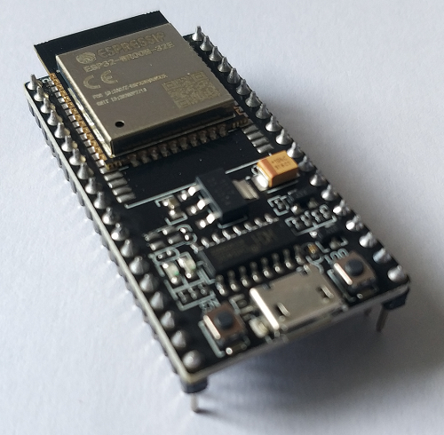
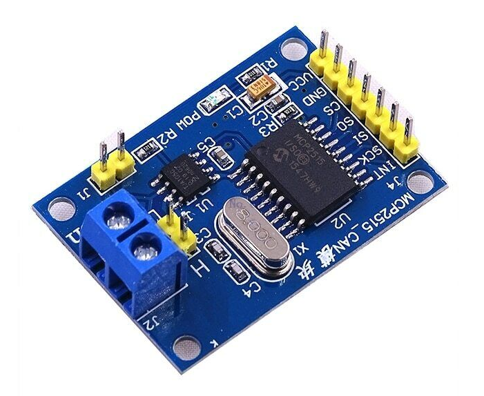
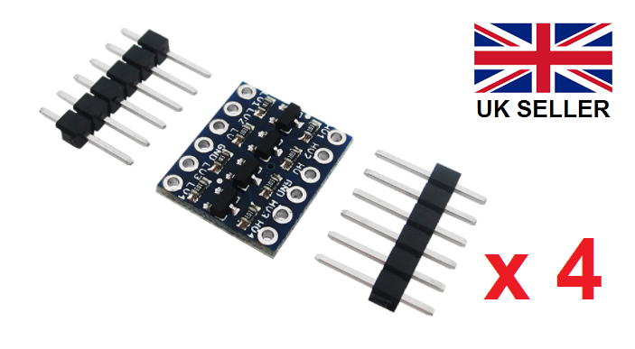
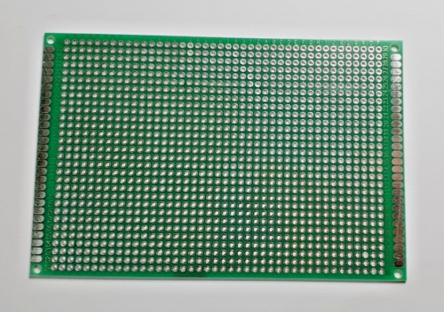
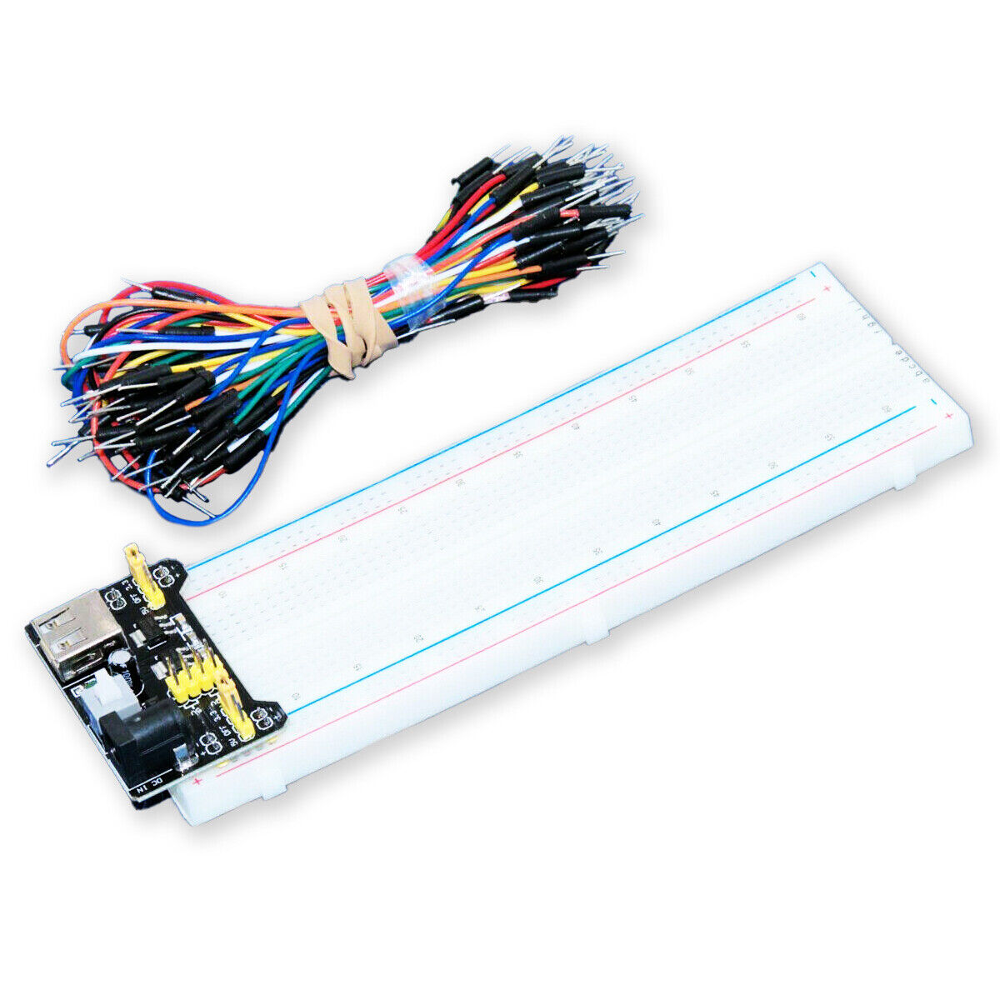
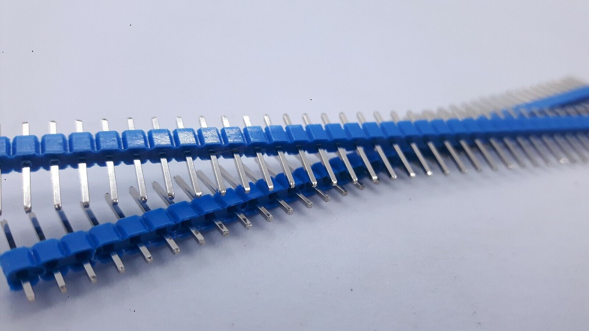
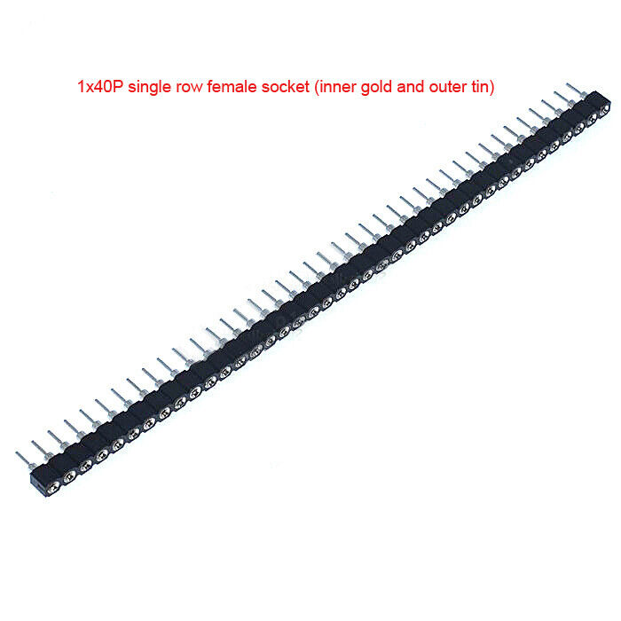
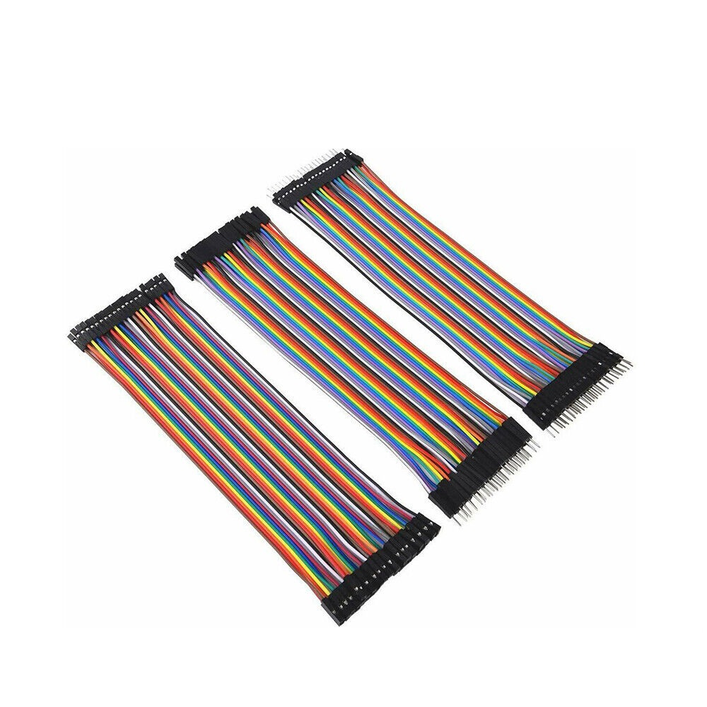
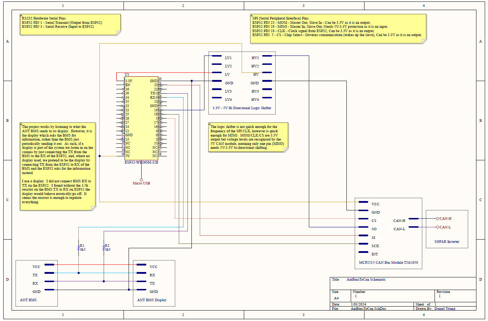

# AntBmsToCan
## An ESP32 and MCP2515 based DIY project to enable CAN-bus comms between inverters and DIY solar batteries which use AntBMS.

The project needs very little soldering, making use of off-the-shelf components and jumper wires to do most of the heavy lifting.  That said, if you are making your own solar battery the chances are you are not adverse to soldering anyway.  The project makes use of robust and reliable components in order to ensure solid communication between the BMS and the inverter.  I have been running it continually now for three months without hiccup.  It supports, for use during testing and configuration only, WiFi and MQTT so that values, errors and other output can be easily consumed to help debugging - ideal when you don't have the means to run a laptop or desktop over to where your battery lives.


It's designed to run on an ESP32 microcontroller with a small amount of supporting components.  Estimated cost to build is around £15.


The project works by hooking into the data which is sent between the AntBMS and its optional display.  It packages up the data in a format suitable for CAN communications and fires it along the CAN line to the inverter.  It is a relatively simple (in the grand scheme of things) premise but works to good effect.  You don't need the optional AntBMS display for this to work.


This project extends a heavy thanks to the work done by the following talented individuals:
- [JuWorkshop - AntBms-to-Ve.Can-Victron-Venus](https://github.com/JuWorkshop/AntBms-to-Ve.Can-Victron-Venus)
- [Sebastian Muszynski - ESPhome Ant BMS](https://github.com/syssi/esphome-ant-bms)
- [SetFireLabs - Pylontech CAN Reading & CAN Replication](https://www.setfirelabs.com/green-energy/pylontech-can-reading-can-replication)


### Inverters Confirmed Working:
```
Any SOFAR inverters - using Pylontech
*Other makes and models will likely work too as BMS CAN-bus is largely an adopted standard specification originally devised by Pylontech.  Be sure to let me know if yours needs adding!
```

<a href="Pics\IMG_1452.JPG" target="_new"></a>


We will run through the MQTT communications first to get them out of the way, we will then look at building and implementation.  I will endeavour to help if you get stuck.  Try email or [Facebook](https://www.facebook.com/mydan100/).


Enjoy.


Daniel Young 2023/24 [daniel@mydan.com](daniel@mydan.com)


# MQTT Communication
**WiFi and MQTT support is only provided to assist in debugging!  Only use WiFi and MQTT during debugging, as WiFi and MQTT connectivity is a blocking requirement - i.e. the program will hold until WiFi and MQTT is connected.  This means if WiFi or MQTT connection drops, the comms between your AntBMS and your inverter will stop meaning your inverter will go into fault mode and will need bringing back out!!**

## Current State
The MQTT topic to subscribe to is:
```
AntBmsToCan/bms/details
```
### bms/details
By default, every 10 seconds a message will be sent out on this topic.  The payload is a JSON of name/value pairs of every reading out of the BMS.  As such, your results will look like so:

```
{
    "rawTotalVoltage": %d,
    "rawCurrent": %d,
    "rawCurrentAsFloat": %d,
    "rawSoc": %d,
    "rawTemperatureMosfet": %d,
    "rawMaxCellVoltage": %d,
    "rawMinCellVoltage": %d,
    "totalVoltage": %d,
    "cells": %d,
    "cellVoltage1": %d,
    "cellVoltage2": %d,
    "cellVoltage3": %d,
    "cellVoltage4": %d,
    "cellVoltage5": %d,
    "cellVoltage6": %d,
    "cellVoltage7": %d,
    "cellVoltage8": %d,
    "cellVoltage9": %d,
    "cellVoltage10": %d,
    "cellVoltage11": %d,
    "cellVoltage12": %d,
    "cellVoltage13": %d,
    "cellVoltage14": %d,
    "cellVoltage15": %d,
    "cellVoltage16": %d,
    "cellVoltage17": %d,
    "cellVoltage18": %d,
    "cellVoltage19": %d,
    "cellVoltage20": %d,
    "cellVoltage21": %d,
    "cellVoltage22": %d,
    "cellVoltage23": %d,
    "cellVoltage24": %d,
    "cellVoltage25": %d,
    "cellVoltage26": %d,
    "cellVoltage27": %d,
    "cellVoltage28": %d,
    "cellVoltage29": %d,
    "cellVoltage30": %d,
    "cellVoltage31": %d,
    "cellVoltage32": %d,
    "current": %d,
    "soc": %d,
    "totalBatteryCapacitySetting": %d,
    "capacityRemaining": %d,
    "batteryCycleCapacity": %d,
    "totalRuntime": %d,
    "temperatures1Mosfet": %d,
    "temperatures2Balancer": %d,
    "temperatures3Sensor1": %d,
    "temperatures4Sensor2": %d,
    "temperatures5Sensor3": %d,
    "temperatures6Sensor4": %d,
    "chargeMosfetStatus": %d,
    "chargingSwitch": %d,
    "dischargeMosfetStatus": %d,
    "dischargingSwitch": %d,
    "balancerStatus": %d,
    "balancerSwitch": %d,
    "power": %d,
    "cellWithHighestVoltage": %d,
    "maxCellVoltage": %d,
    "cellWithLowestVoltage": %d,
    "minCellVoltage": %d,
    "deltaCellVoltage": %d,
    "averageCellVoltage": %d,
    "batteryStrings": %d,
    "_bmsValidResponseCounter": %d,
    "_bmsInvalidResponseCounter": %d,
    "_canSuccessCounter": %d,
    "_canFailureCounter": %d
}
```
Where %d is the value from your AntBMS at the time it was read out.

## Errors
In addition, The MQTT topics to subscribe to are:
```
AntBmsToCan/bms/notenoughdata
AntBmsToCan/bms/failedchecksum
AntBmsToCan/bms/failedheader
AntBmsToCan/can/failsend
AntBmsToCan/can/txerrorcount
```
### bms/notenoughdata
This is pushed out when the length of data received by the AntBMS wasn't correct.  The payload is a JSON name/value pair as follows:
```
{
    "bytesReceived": %d
}
```
Where %d is the number of bytes received.  We expect 140.


### bms/failedchecksum
This is pushed out when the appropriate amount of data was received from the AntBMS, however the data did not pass a mathematical formula to ensure it is data fit for purpose.  You can consider this akin to data being corrupted by noise on the line.  The payload is an empty JSON:
```
{
}
```


### bms/failedheader
This is pushed out when the appropriate amount of data was received from the AntBMS, and the data was verified as correct, but where the header to the message was incorrect.  This is likely to be an incompatible AntBMS device or firmware version.  The payload is an empty JSON:
```
{
}
```


### bms/failsend
This is sent when a CAN message fails to be sent to the inverter.  The payload is JSON of name value pairs as follows:
```
{
    "id": %i
    "canResult": %r
}
```
Where %i is the id of the message being sent, in the format 0x00000000 and where %r is the error code from the MCP-CAN library and can be one of:
```
#define CAN_OK             (0)
#define CAN_FAILINIT       (1)
#define CAN_FAILTX         (2)
#define CAN_MSGAVAIL       (3)
#define CAN_NOMSG          (4)
#define CAN_CTRLERROR      (5)
#define CAN_GETTXBFTIMEOUT (6)
#define CAN_SENDMSGTIMEOUT (7)
#define CAN_FAIL           (0xff)
```


### bms/txerrorcount
This is a cumulative number of CAN transmit errors since the device was booted.  The payload is JSON name/value pair as follows:
```
{
    "txErrorCount": %i
}
```
Where %i is the number of errors since the device was booted.


# How To Build

## Reasons Underpinning Design Choices
### Why not use the internal ESP32 CAN controller?
I know the ESP32 has a CAN controller inbuilt, meaning in theory it is possible to get away with just buying the transceiver.  That said, CAN should run at 5V, and the transceiver only modules mostly run at 3.3V (outside of spec) and are of questionable quality - ala [this garbage SN65HVD230](https://www.ebay.co.uk/itm/266023445479).  Not all transceivers have CAN termination functionality built in (which we need) and further, the libaries out there for CAN using these transceivers (i.e. Sandeep Mistry's) are old and deprecated.  I didn't have success with a multitude of transceivers and libraries.  The 5V MCP2515 with the MCP_CAN library worked straight away and has been rock solid in performance.  Given the cost was around £5 it really wasn't worth the hassle to get a second rate approach working.


I recognise that the MCP2515 module works at 5V and the ESP32's input pins are only tolerant of 3.3V, as such, we need to protect one output pin from the MCP2515 to the ESP32 - MISO (Master In, Slave Out) by using a bi-directional 3.3V - 5V logic shifter.  MOSI (Master Out, Slave In), CLK and CS are all output pins and so we don't need to protect those.  INT is not used.


## Parts List
1. An ESP32 microcontroller

2. An MCP2515/TJA1050 CAN module

3. A bi-directional (at least single channel) 3.3V - 5V logic shifter

4. **If using a prototyping board** A prototyping board - 120mm x 80mm OR

5. **If using a breadboard** A smallish breadboard

6. **If needed** Miscellaneous 2.54mm pitch male and female headers, and mix of varying length jumper wires

7. Some 2 Core or 3 Core 30 AWG Cable***

8. 2 * 3.5k resistors (1 if you use a display)


*** You will need enough 2 or 3 core cable to reach from your AntBMS to the AntBmsToCan device.  Black is likely to be a better colour for the project.  You need 2 core cable if you use a display.  If you don't use a display you need 3 core cable.


### ESP32 + optional case : ESP32-WROOM-32E : Development Board Dual Core : LATEST!


Forgoe the box.  I guess any ESP32 variant will do, but I use the 38 pin version with 3V3 and GND at the top left and right respectively.  I bought [for £6.95 including P&P](https://www.ebay.co.uk/itm/195866751998)


### Mcp2515 CAN Bus Module TJA1050 Receiver SPI Module Arduino _UK Fast


I bought [for £4.90 including P&P](https://www.ebay.co.uk/itm/154316486567)


### 4 x 4-channel Bi-Directional Logic Level Shifter Converter 3.3V 5V, arduino etc


I bought four of these [for £4.00 including P&P](https://www.ebay.co.uk/itm/192935589714)


### Prototype Board - Double Sided - 80x120mm - 8x12cm Green / Silver - UK Free P&P


I bought [this for £2.99 including P&P](https://www.ebay.co.uk/itm/266162433248)


### 830 Point Prototype PCB Breadboard MB102 + 65pcs Jump Cable Wires + Power Module


I bought [this for £5.95 including P&P](https://www.ebay.co.uk/itm/262622284308) which included a power module (not really needed) and jumper wires


### 40pin 2.54mm Single Row Male Pin Header for Arduino uno MINI R3 ETC snap to size


You can buy male headers [here](https://www.ebay.co.uk/itm/123991187180)


### Single Row Round Hole Female Header Pin Header 2.54MM 1*4/40P 2*40 Gold Plated


You can buy female headers [here](https://www.ebay.co.uk/itm/354733633355)


### 40 PIN DUPONT WIRE BREADBOARD JUMPER WIRES RIBBON CABLES M-F/M-M/F-F 10/20/30CM


You can buy a selection of jumper wires (though I only use Female-Female between 10cm and 15cm) [here](https://www.ebay.co.uk/itm/223760125560)


My breadboard implementation below uses:
- 6 * 10cm Male to Female Jumper Wire
- 7 * 10cm Male to Male Jumper Wire
- 1 * 10cm Female to Female Jumper Wire (CAN termination)
- No female headers
- Breadboard
- 2 * 6 pin male headers for the logic shifter
- Up to 3 * 10cm Male to Male Jumper Wire (one end cut off and twisted to three core or two core cable, depending on need)

But ultimately, your build is unique to you, so only buy what you need!


## Schematic and ESP32 Pinout
The full schematic is below and you can click on it to open a larger copy.  This is what we will be building today.

<a href="Pics/Schematic.PNG" target="_new"></a>

You can download a PDF of the schematic [here](Pics/Schematic.PDF).


The ESP32 pinout is here for your reference and you can click on it to open a larger copy.  Credit to [uPesy](https://www.upesy.com/blogs/tutorials/esp32-pinout-reference-gpio-pins-ultimate-guide) for creating this image as part of their awesome guide.

<a href="Pics/doc-esp32-pinout-reference-wroom-devkit.webp" target="_new"></a>


## Construction
1. Push the ESP32 in at the bottom of the breadboard in the middle
2. Push the logic shifter in just above
3. Rest the MCP2515 nearby, perhaps some double sided tape to the top of the breadboard
4. Use a M-M jumper wire to connect 5V to the left rail for 5V
5. Use a M-M jumper wire to connect GND to the right rail for GND
6. Use a M-M jumper wire to connect 3V3 to LV on the logic converter
7. Use a M-M jumper wire to connect GPIO19 (VSPI_MISO) to LV1 on the logic converter
8. Use a M-F jumper wire to connect HV1 on the logic converter to (MI)SO on MCP2515
9. Use a M-M jumper wire to connect the GND rail to GND on the LV side of the logic converter
10. Use a M-M jumper wire to connect the GND rail to GND on the HV side of the logic converter
11. Use a M-M jumper wire to connect the 5V rail to HV on the logic converter
12. Use a M-F jumper wire to connect GPIO23 (VSPI_MOSI) to (MO)SI on the MCP2515
13. Use a M-F jumper wire to connect GPIO18 (VSPI_CLK) to SCK on the MCP2515
14. Use a M-F jumper wire to connect GPIO5 (VSPI_CS) to CS on the MCP2515
15. Use a M-F jumper wire to connect the 5V rail to VCC on the MCP2515
16. Use a M-F jumper wire to connect the GND rail to GND on the MCP2515
17. Use a M-M (one end cut off) jumper wire to connect the GND rail to one of the cores of the 3 (or 2) core cable
18. Use a M-M (one end cut off) jumper wire to connect GPIO1 (TX0) to one of the cores of the 3 core cable (if not using a display)
19. Use a M-M (one end cut off) jumper wire to connect GPIO3 (RX0) to one of the cores of the 3 (or 2) core cable


And here is the finished design on a breadboard ready for the GND/TX/RX comm wires to the BMS and CAN H and CAN L to the inverter:


<a href="Pics\IMG_1452.JPG" target="_new"></a>


<a href="Pics\IMG_1454.JPG" target="_new"></a>


<a href="Pics\IMG_1456.JPG" target="_new"></a>


# Programming
## Configuration
Download the AntBmsToCan.ino file into a folder called AntBmsToCan.

Configure your AntBmsToCan by opening up AntBmsToCan.ino and verifying/customising the following definitions for your need:
```
- If you want to use WiFi temporarily to test the device, ensure '#define USE_WIFI_AND_MQTT' is NOT commented out with //
- If using WiFi:
-   Set WIFI_SSID to your WiFi Access Point name
-   Set WIFI_PASSWORD to your WiFi password
-   Set MQTT_SERVER to your MQTT broker IP
-   Set MQTT_PORT to your MQTT broker port (Default is 1883)
-   Set MQTT_USERNAME to a username configured in your MQTT broker
-   Set MQTT_PASSWORD to a password configured in your MQTT broker
-   Set DEVICE_NAME to a different name if you wish.  NB: The device name is used as the MQTT base topic and presence on the network.  This is useful if you have more than two AntBmsToCan 
- When you want to disable WiFi because all your testing is done, ensure '#define USE_WIFI_AND_MQTT' is commented out with //
- Set CHARGE_VOLTAGE_LIMIT_CVL_IN_MILLIVOLTS to the millivolts max charge per cell (See comments about how this works in the file)
- Set CHARGE_CURRENT_LIMIT_IN_TENTHS_OF_AN_AMP to the tenths of an amp max charge current (See comments about how this works in the file)
- Set DISCHARGE_CURRENT_LIMIT_IN_TENTHS_OF_AN_AMP to the tenths of an amp max discharge current (See comments about how this works in the file)
- Set DISCHARGE_VOLTAGE_LIMIT_DVL_IN_MILLIVOLTS to the millivolts max discharge per cell (See comments about how this works in the file)
```

## Software Configuration
### Drivers
Download and install the [Wemos CH340 Driver](https://www.wemos.cc/en/latest/ch340_driver.html).
### Arduino IDE
Download and install the [Arduino IDE](https://www.arduino.cc/en/software).
### ESP32 Libraries
Once installed and set up, you'll need the libraries for the ESP32. Follow [this guide](https://randomnerdtutorials.com/installing-esp32-arduino-ide-2-0/) if you haven't completed that step before.
### Other Libraries
Add a few more libraries using the Tools / Manage Libraries menu:

1. PubSubClient by Nick O'Leary (V2.8 used at the time of development)

2. mcp_can by coryjfowler (V1.5.1 used at the time of development)

Choose NodeMCU-32S as your board, choose the COM port for your board ...and upload.

After uploading, and if you have enabled WiFi and MQTT, ideally it will connect to WiFi (confirming those details are right) and connect to MQTT (confirming those details are right) and you may see some messages on your MQTT broker.  I suggest using [MQTT Explorer](https://mqtt-explorer.com/).  Congratulations.  You are ready to take out to the battery for final setup.


# Final Setup
OK so, as alluded to already...  You may use a display or you may not.  Follow the appropriate steps:

## Using A Display
Cool, just like me.  You just need two core wire to hook up to the BMS and a single 3.5k resistor.

- Cut back the sheath of GND from the AntBMS comms wire to the display and connect one of the cores to it
- Cut back the sheath of TX out on the AntBMS comms wire to the display and connect the other core to it
- Connect the 3.5k resistor to the other end of your TX core
- Connect the other end of the 3.5k resistor to the M-M you butchered and plugged into GPIO3 (RX0) of the ESP32
- Connect the GND from the AntBMS comms wire to the GND rail on your AntBmsToCan
- Connect CAN H to CAN H of your inverter (You may need to fashion up or otherwise obtain a crimped cable to plug in to the socket)
- Connect CAN L to CAN L of your inverter (You may need to fashion up or otherwise obtain a crimped cable to plug in to the socket)


The moment you connect up the CAN H and CAN L and power on the device, your inverter will likely automatically flick into automatic CAN mode as per my SOFAR.

## Without A Display
A little bit more work as we need to pretend to be the display.  You need three core wire to hook up to the BMS and two 3.5k resistors.  You may need to fashion up a comms cable to fit the port.

- Cut back the sheath of GND from the AntBMS comms port and connect one of the cores to it
- Cut back the sheath of TX out on the AntBMS comms wire and connect a core to it
- Cut back the sheath of RX out on the AntBMS comms wire and connect the final core to it
- Connect the 3.5k resistor to the other end of your TX core
- Connect the 3.5k resistor to the other end of your RX core
- Connect the other end of the TX core 3.5k resistor to the M-M you butchered and plugged into GPIO3 (RX0) of the ESP32
- Connect the other end of the RX core 3.5k resistor to the M-M you butchered and plugged into GPIO1 (TX0) of the ESP32
- Connect the GND from the AntBMS comms wire to the GND rail on your AntBmsToCan
- Connect CAN H to CAN H of your inverter (You may need to fashion up or otherwise obtain a crimped cable to plug in to the socket)
- Connect CAN L to CAN L of your inverter (You may need to fashion up or otherwise obtain a crimped cable to plug in to the socket)

The moment you connect up the CAN H and CAN L and power on the device, your inverter will likely automatically flick into automatic CAN mode as per my SOFAR.


## My Setup
My implementation, together with a Sofar2MQTT on a prototyping board all in a project box looks like so:


<a href="Pics\project.jpeg" target="_new"></a>


Best of luck!


# AntBmsToCan Around The World
If you build your own AntBmsToCan, be sure to send me pictures of it in action so I can add it to this page!  I'd love to hear from you.